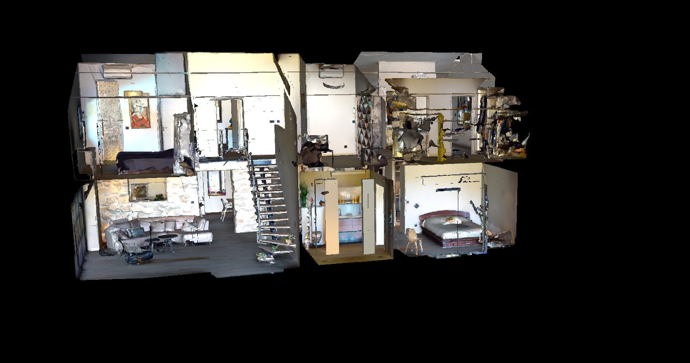
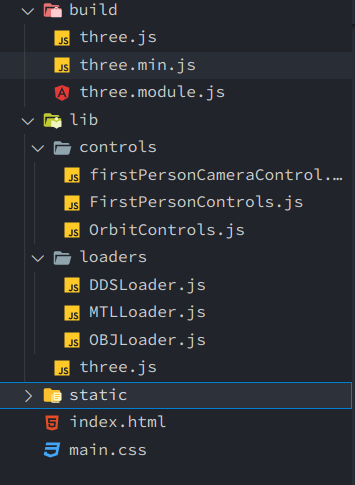

# Three.Js实现第一人称漫游

##  1.实现效果


​														   漫游效果

​									

​															模型概览

## 2.项目准备

- 模型——https://github.com/matterport/habitat-matterport-3dresearch
- 第一人称漫游漫游效果主要参考代码——https://github.com/code945/FirstPersonCameraControl

## 3.项目结构



- 目录build存放three.js
- 目录lib存放所需loaders和controls.模型为obj+mtl格式，需要引用ThreeJS的MTLLoader.js和OBJLoader模块
- 目录static存放模型和其他静态资源

## 4.核心代码

```js
/*index.html部分*/
//选用透视相机,相机默认放置在（0，0，0）与物体放置位置重合，符合需求
camera = new THREE.PerspectiveCamera( 45, window.innerWidth / window.innerHeight, 1, 1000 );
//加载模型
		new MTLLoader( manager )
			.setPath( './static/models/m1/' )
			.load( 'm1.mtl', function ( materials ) {							materials.preload();
				new OBJLoader( manager )
					.setMaterials( materials )
					.setPath( './static/models/m1/' )
					.load( 'm1.obj', function ( object ) {
                         model=object;
                         console.log(model)
                         model.rotateX(-Math.PI/2)
                         console.log(object.position);
                         object.scale.set(10,10,10);                            			scene.add( object );
					}, onProgress, onError );
			} );
/*firstPersonCameraCtrol.js部分*/
/*监听键盘输入，w-s-a-d控制相机前进后退左右
  方向箭头控制相机旋转
*/
onKeyDown(event) {
        switch (event.keyCode) {
            case 38: // up
                this.rotateY(-3);
                break;
            case 87: // w
                this.camera.translateZ(-1);
                break;
            case 37: // left
                this.rotateX(-3);
                break;
            case 65: // a
                this.camera.translateX(-1);
                break;
            case 40: // down
                this.rotateY(3);
                break;
            case 83: // s
                this.camera.translateZ(1);
                break;
            case 39: // right
                this.rotateX(3);
                break;
            case 68: // d
                this.camera.translateX(1);
                break;
        }
    }
```

## 5.下一步计划

完善重力检测和碰撞检测

## 6.Blog

https://www.qiuming.top/archives/threejs%E7%AC%AC%E4%B8%80%E4%BA%BA%E7%A7%B0%E6%BC%AB%E6%B8%B8
